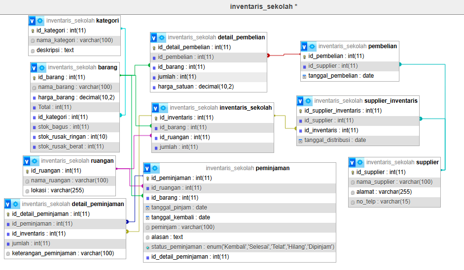
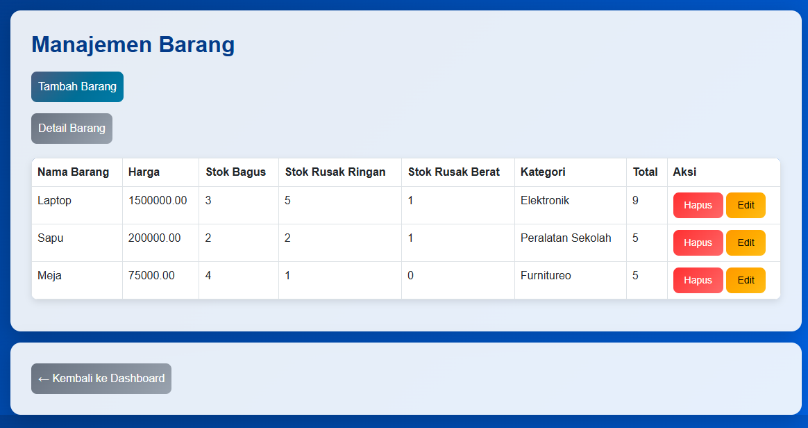
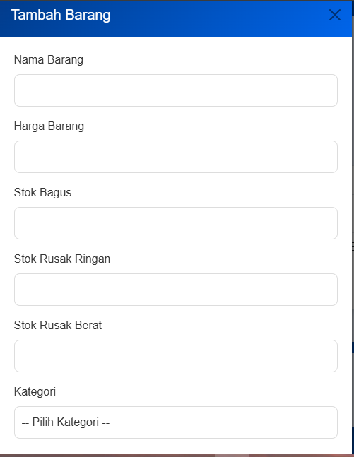
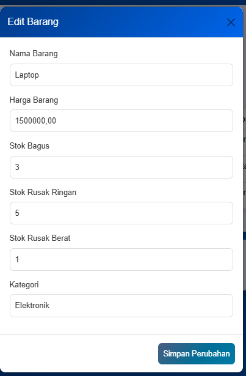
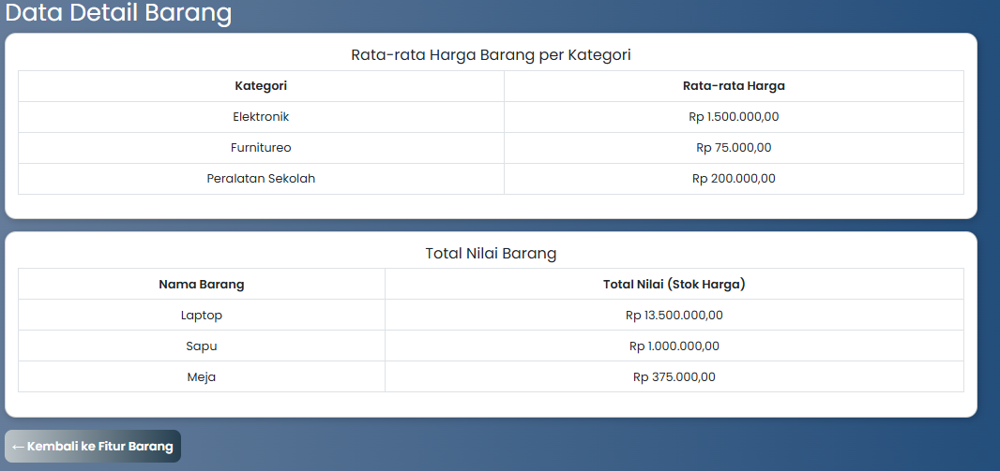
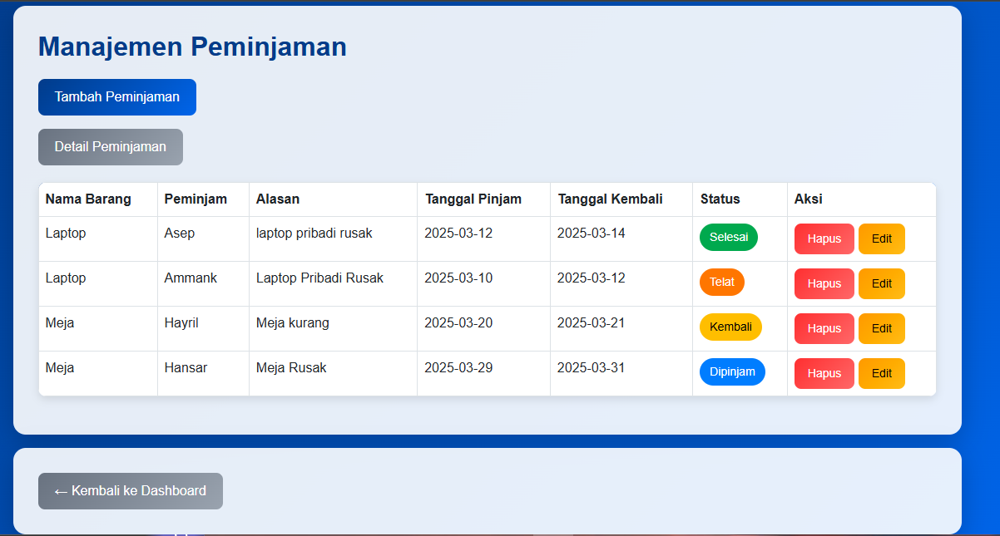
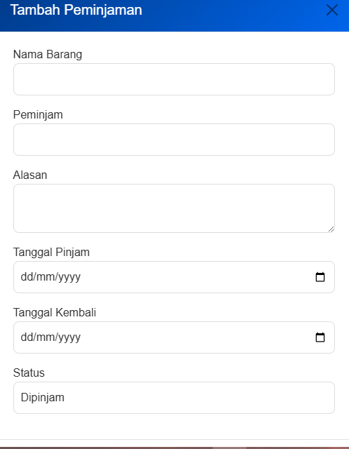
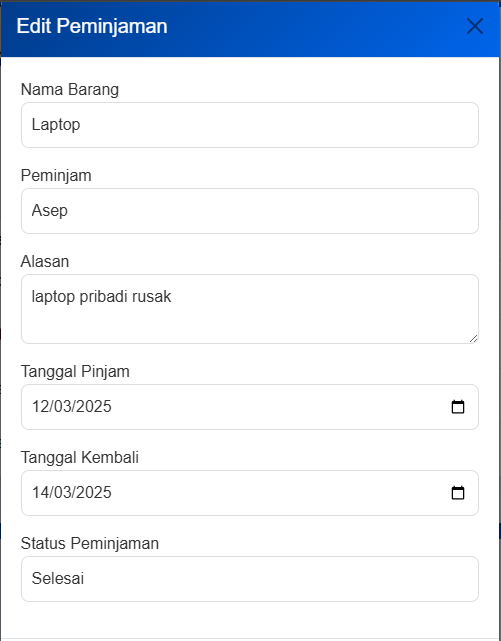
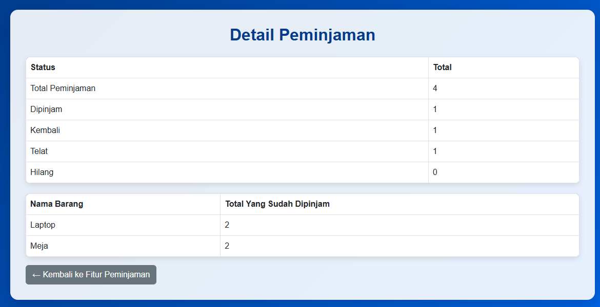

# Laporan Fitur Aplikasi Sistem Inventaris

## 1. Deskripsi Fitur
Laporan ini menjelaskan fitur-fitur yang telah dibuat dalam sistem inventaris berbasis web. Fitur-fitur ini mencakup pengelolaan barang, peminjaman,supplier, dan autentikasi. Setiap fitur memiliki peran penting dalam memastikan sistem berjalan dengan baik dan data terorganisir dengan benar.
##### a. Login(autentikasi)
Fitur login digunakan untuk mengautentikasi pengguna sebelum mengakses sistem. Setiap pengguna harus memasukkan username dan password yang valid untuk mendapatkan akses sesuai dengan perannya.
##### b. CRUD Barang
Fitur ini memungkinkan pengguna untuk mengelola data barang, termasuk menambahkan, mengedit, menghapus, dan melihat daftar barang yang tersedia di inventaris.
##### c. CRUD Supplier
Fitur ini digunakan untuk mengelola data supplier atau pemasok barang, seperti menambah, mengedit, menghapus, dan menampilkan informasi pemasok barang.
##### d. CRUD Peminjaman
Fitur ini memungkinkan pencatatan peminjaman barang. Peminjam dapat mencatat barang yang dipinjam, alasan peminjaman, serta tanggal pinjam dan kembali.

## 2. Database
#### Gambar Database

#### Penjelasan Masing-Masing Tabel
- **users**: Menyimpan informasi pengguna, termasuk username,dan password.
- **barang**: Berisi daftar barang yang tersedia dalam inventaris.
- **supplier**: Menyimpan informasi pemasok barang.
- **peminjaman**: Menyimpan data peminjaman barang oleh pengguna.

## 3. Rincian Fitur
**Screenshot fitur** (Barang)
**DAFTAR BARANG**


**TAMBAH BARANG**


**EDIT BARANG**


**DetailBarang**

**Penjelasan Hasil Program**
Saat kode ini dijalankan, program akan menampilkan:
- **Tabel daftar barang** yang berisi informasi barang termasuk stok dan kategori.
- **Tombol tambah barang** yang membuka modal untuk menginput barang baru.
- **Tombol edit barang** di setiap baris untuk mengubah data barang yang ada.
- **Tombol hapus barang** untuk menghapus barang dari database.
- Tombol detail barang untuk melihat rata rata harga barang perkategori dan nilai total barang.

- **Kode program front-end**
```html
<body>
    <div class="container mt-4">
        <h2>Manajemen Barang</h2>
        <button class="btn btn-primary mb-3" data-bs-toggle="modal" data-bs-target="#tambahbarang">Tambah Barang</button>
        <!-- Tabel Barang -->
        <table class="table table-bordered">
            <thead>
                <tr>
                    <th>Nama Barang</th>
                    <th>Harga</th>
                    <th>Stok Bagus</th>
                    <th>Stok Rusak Ringan</th>
                    <th>Stok Rusak Berat</th>
                    <th>Kategori</th>
                    <th>Total</th>
                    <th>Aksi</th>
                </tr>
            </thead>
            <tbody>
                <?php while ($row = mysqli_fetch_assoc($result)) { ?>
                <tr>
                    <td><?= $row['nama_barang'] ?></td>
                    <td><?= $row['harga_barang'] ?></td>
                    <td><?= $row['stok_bagus'] ?></td>
                    <td><?= $row['stok_rusak_ringan'] ?></td>
                    <td><?= $row['stok_rusak_berat'] ?></td>
                    <td><?= $row['nama_kategori'] ?></td>
                    <td><?= $row['stok_bagus'] + $row['stok_rusak_ringan'] + $row['stok_rusak_berat'] ?></td>
                    <td>
                        <a href="barang.php?hapus=<?= $row['id_barang'] ?>" class="btn btn-danger btn-sm">Hapus</a>
                        <button class="btn btn-warning btn-sm" data-bs-toggle="modal" data-bs-target="#editBarang<?= $row['id_barang'] ?>">Edit</button>
                </td>
                </tr>

                <!-- Modal Tambah Barang -->

<div class="modal fade" id="tambahbarang" tabindex="-1" aria-labelledby="tambahbarangLabel" aria-hidden="true">

    <div class="modal-dialog">

        <div class="modal-content">

            <form method="POST">

                <div class="modal-header">

                    <h5 class="modal-title">Tambah Barang</h5>

                    <button type="button" class="btn-close" data-bs-dismiss="modal" aria-label="Close"></button>
                </div>
                <div class="modal-body">
                    <div class="mb-3">
                        <label class="form-label">Nama Barang</label>
                        <input type="text" class="form-control" name="nama_barang" required>
                    </div>
                    <div class="mb-3">
                        <label class="form-label">Harga Barang</label>
                        <input type="number" class="form-control" name="harga_barang" required>
                    </div>
                    <div class="mb-3">
                        <label class="form-label">Stok Bagus</label>
                        <input type="number" class="form-control" name="stok_bagus" required>
                    </div>
                    <div class="mb-3">
                        <label class="form-label">Stok Rusak Ringan</label>
                        <input type="number" class="form-control" name="stok_rusak_ringan" required>
                    </div>
                    <div class="mb-3">
                        <label class="form-label">Stok Rusak Berat</label>
                        <input type="number" class="form-control" name="stok_rusak_berat" required>

                    </div>

                    <div class="mb-3">

                        <label class="form-label">Kategori</label>

                        <select class="form-control" name="id_kategori" required>

                            <option value="">-- Pilih Kategori --</option>

                            <?php

                            $kategori = mysqli_query($conn, "SELECT * FROM kategori");

                            while ($kat = mysqli_fetch_assoc($kategori)) {

                                echo "<option value='{$kat['id_kategori']}'>{$kat['nama_kategori']}</option>";

                            }

                            ?>
                        </select>
                    </div>
                </div>
                <div class="modal-footer">
                    <button type="submit" name="tambah" class="btn btn-primary">Tambah Barang</button>
               </div>
            </form>
        </div>
    </div>
</div>
                <!-- Modal Edit Barang -->
                <div class="modal fade" id="editBarang<?= $row['id_barang'] ?>" tabindex="-1" aria-hidden="true">

                    <div class="modal-dialog">

                        <div class="modal-content">

                            <form method="POST">

                                <div class="modal-header">

                                    <h5 class="modal-title">Edit Barang</h5>

                                    <button type="button" class="btn-close" data-bs-dismiss="modal"></button>

                                </div>

                                <div class="modal-body">

                                    <input type="hidden" name="id_barang" value="<?= $row['id_barang'] ?>">

                                    <div class="mb-3">

                                        <label class="form-label">Nama Barang</label>

                                        <input type="text" class="form-control" name="nama_barang" value="<?= $row['nama_barang'] ?>" required>

                                    </div>
                                    <div class="mb-3">
                                        <label class="form-label">Harga Barang</label>
                                        <input type="number" class="form-control" name="harga_barang" value="<?= $row['harga_barang'] ?>" required>

                                    </div>
                                    <div class="mb-3">
                                        <label class="form-label">Stok Bagus</label>
                                        <input type="number" class="form-control" name="stok_bagus" value="<?= $row['stok_bagus'] ?>" required>

                                    </div>

                                    <div class="mb-3">

                                        <label class="form-label">Stok Rusak Ringan</label>

                                        <input type="number" class="form-control" name="stok_rusak_ringan" value="<?= $row['stok_rusak_ringan'] ?>" required>

                                    </div>

                                    <div class="mb-3">

                                        <label class="form-label">Stok Rusak Berat</label>

                                        <input type="number" class="form-control" name="stok_rusak_berat" value="<?= $row['stok_rusak_berat'] ?>" required>

                                    </div>

                                    <div class="mb-3">

                                        <label class="form-label">Kategori</label>

                                        <select class="form-control" name="id_kategori" required>

                                            <?php
                                            $kategori = mysqli_query($conn, "SELECT * FROM kategori");
                                            while ($kat = mysqli_fetch_assoc($kategori)) {
                                                $selected = ($kat['id_kategori'] == $row['id_kategori']) ? 'selected' : '';
                                                echo "<option value='{$kat['id_kategori']}' $selected>{$kat['nama_kategori']}</option>";
                                            }
                                            ?>
                                        </select>
                                    </div>
                                </div>
                                <div class="modal-footer">
                                    <button type="submit" name="edit" class="btn btn-primary">Simpan Perubahan</button>
                                </div>
                            </form>
                        </div>
                    </div>
                <?php } ?>
            </tbody>
        </table>
    </div>
    <div class="container mt-3">
    <a href="agregasi_barang.php" class="btn btn-secondary"> Agregasi Fitur Barang</a>
</div>
    <div class="container mt-3">
    <a href="dashboard.php" class="btn btn-secondary">← Kembali ke Dashboard</a>
</div>
    <script src="https://cdn.jsdelivr.net/npm/bootstrap@5.3.0/dist/js/bootstrap.bundle.min.js"></script>
</body>
</html>
```

- **Kode program back-end**
```php
<?php
session_start();
include 'koneksi.php';

// TAMBAH BARANG
if (isset($_POST['tambah'])) {
    $nama_barang = mysqli_real_escape_string($conn, $_POST['nama_barang']);
    $harga_barang = (float)$_POST['harga_barang'];
    $stok_bagus = (int)$_POST['stok_bagus'];
    $stok_rusak_ringan = (int)$_POST['stok_rusak_ringan'];
    $stok_rusak_berat = (int)$_POST['stok_rusak_berat'];
    $id_kategori = (int)$_POST['id_kategori'];
    // Pastikan Total dihitung
    $total = $stok_bagus + $stok_rusak_ringan + $stok_rusak_berat;
    // Periksa apakah kategori valid
    $cek_kategori = mysqli_query($conn, "SELECT * FROM kategori WHERE id_kategori = '$id_kategori'");
    if (mysqli_num_rows($cek_kategori) == 0) {
        die("Error: Kategori tidak ditemukan.");
    }
    $query = "INSERT INTO barang (nama_barang, harga_barang, stok_bagus, stok_rusak_ringan, stok_rusak_berat, id_kategori, Total)
              VALUES ('$nama_barang', '$harga_barang', '$stok_bagus', '$stok_rusak_ringan', '$stok_rusak_berat', '$id_kategori', '$total')";
    if (mysqli_query($conn, $query)) {
        header("Location: barang.php");
        exit();
    } else {
        die("Error: " . mysqli_error($conn));
    }

}


//HAPUS BARANG
if (isset($_GET['hapus'])) {
    $id_barang = (int)$_GET['hapus'];
    // Periksa apakah barang ada di database sebelum menghapus
    $cek = mysqli_query($conn, "SELECT * FROM barang WHERE id_barang='$id_barang'");
    if (mysqli_num_rows($cek) > 0) {
        $delete = mysqli_query($conn, "DELETE FROM barang WHERE id_barang='$id_barang'");
        if ($delete) {
            header("Location: barang.php?success=hapus");
            exit();
        } else {
            echo "<script>alert('Gagal menghapus barang.'); window.location.href='barang.php';</script>";
        }
    } else {
        echo "<script>alert('Barang tidak ditemukan.'); window.location.href='barang.php';</script>";
    }
}

// Edit Barang
if (isset($_POST['edit'])) {
    $id_barang = $_POST['id_barang'];
    $nama_barang = $_POST['nama_barang'];
    $harga_barang = $_POST['harga_barang'];
    $stok_bagus = $_POST['stok_bagus'];
    $stok_rusak_ringan = $_POST['stok_rusak_ringan'];
    $stok_rusak_berat = $_POST['stok_rusak_berat'];
    $id_kategori = $_POST['id_kategori'];

    $query = "UPDATE barang SET nama_barang='$nama_barang', harga_barang='$harga_barang',

              stok_bagus='$stok_bagus', stok_rusak_ringan='$stok_rusak_ringan', stok_rusak_berat='$stok_rusak_berat', id_kategori='$id_kategori'
              WHERE id_barang='$id_barang'";
    mysqli_query($conn, $query);
    header("Location: barang.php");
}
// Ambil data barang dengan join ke kategori
$result = mysqli_query($conn, "SELECT barang.*, kategori.nama_kategori
                               FROM barang
                               JOIN kategori ON barang.id_kategori = kategori.id_kategori");
?>
```

**Penjelasan Kode Program**
Kode ini merupakan bagian dari sistem manajemen barang berbasis web yang dibuat menggunakan **PHP dan MySQL**. Sistem ini memungkinkan pengguna untuk menambah, mengedit, menghapus, dan menampilkan barang dalam database.
 **Fitur yang Tersedia:**
1. **Autentikasi Pengguna**
    - `session_start();` digunakan untuk memulai sesi pengguna.
    - Jika tidak ada sesi `id_user`, pengguna akan **diredirect** ke halaman login.
2. **Tambah Barang (`tambah`)**
    - Data barang diambil dari **form input** dan dimasukkan ke dalam database dengan query `INSERT INTO barang`.
    - Total stok barang dihitung berdasarkan jumlah stok bagus, stok rusak ringan, dan stok rusak berat.
    - Sebelum menambahkan barang, sistem akan **memeriksa apakah kategori yang dipilih tersedia** di tabel `kategori`.
3. **Hapus Barang (`hapus`)**
    - Barang dapat dihapus berdasarkan `id_barang` yang dikirim melalui parameter URL (`GET`).
    - Sebelum menghapus, sistem **memeriksa apakah barang tersedia** dalam database.
4. **Edit Barang (`edit`)**
    - Pengguna dapat **mengedit informasi barang** seperti nama, harga, stok, dan kategori melalui modal edit.
    - Data yang diperbarui disimpan menggunakan query `UPDATE barang`.
5. **Tampilkan Data Barang**
    - Sistem mengambil data barang dengan **JOIN ke tabel kategori** untuk menampilkan nama kategori barang dalam tabel.
6. **Tampilan Frontend**
    - Menggunakan **Bootstrap 5** untuk tampilan yang lebih menarik.
    - Modal digunakan untuk menampilkan form tambah dan edit barang.
    - Ada tombol aksi untuk **hapus dan edit** pada setiap baris data barang.


**Tabel Database yang Digunakan**
```mysql
CREATE TABLE `barang` {
  `id_barang` int(11) NOT NULL,
  `nama_barang` varchar(100) DEFAULT NULL,
  `harga_barang` decimal(10,2) DEFAULT NULL,
  `Total` int(11) DEFAULT NULL,
  `id_kategori` int(11) DEFAULT NULL,
  `stok_bagus` int(11) NOT NULL,
  `stok_rusak_ringan` int(10) NOT NULL,
  `stok_rusak_berat` int(11) NOT NULL
);
```

 **Peran Fitur dalam Mengelola Database**
- **Insert (`Tambah Barang`)** → Memasukkan data barang ke dalam tabel `barang`.
- **Update (`Edit Barang`)** → Memperbarui informasi barang berdasarkan `id_barang`.
- **Delete (`Hapus Barang`)** → Menghapus barang dari tabel berdasarkan `id_barang`.
- **Read (`Tampilkan Barang`)** → Mengambil dan menampilkan daftar barang dari database.

**Screenshot Fitur (Peminjaman)**
**Daftar Peminjaman**


**Tambah Peminjaman**


**Edit Peminjaman**


**Detail Peminjaman**


 **Penjelasan Hasil Output dari Kode Program**
Kode program ini merupakan halaman manajemen peminjaman barang dalam sistem inventaris berbasis web. Berikut adalah penjelasan mengenai hasil output yang dihasilkan oleh kode program tersebut:

 **1. Halaman Login (Jika Belum Login)**
- Jika pengguna belum login, mereka akan diarahkan ke halaman `login.php`.
- Fitur ini memastikan hanya pengguna yang terautentikasi yang dapat mengakses halaman peminjaman.
**2. Halaman Manajemen Peminjaman**
Setelah login, pengguna akan melihat halaman utama manajemen peminjaman dengan fitur berikut:
**a. Tombol "Tambah Peminjaman"**
- Ketika diklik, tombol ini akan membuka modal pop-up untuk menambahkan data peminjaman baru.
- Pengguna perlu mengisi **Nama Barang, Peminjam, Alasan, Tanggal Pinjam, Tanggal Kembali, dan Status**.
- Setelah disubmit, data peminjaman akan disimpan ke dalam database dan pengguna akan diarahkan kembali ke halaman utama.
**b. Tabel Data Peminjaman**
Menampilkan daftar peminjaman barang yang telah tersimpan dalam database. Data yang ditampilkan meliputi:
- **Nama Barang** (menggunakan **JOIN** antara tabel `peminjaman` dan `barang`).
- **Nama Peminjam**.
- **Alasan Peminjaman**.
- **Tanggal Pinjam & Tanggal Kembali**.
- **Status Peminjaman**, yang ditampilkan dalam bentuk **badge berwarna**:
    - **Selesai** (Hijau)
    - **Dipinjam** (Biru)
    - **Kembali** (Kuning)
    - **Telat** (Oranye)
    - **Hilang** (Merah)
**c. Tombol "Edit" (Untuk Setiap Data)**
- Ketika tombol "Edit" ditekan, modal pop-up akan muncul dengan data yang sudah ada.
- Pengguna dapat mengubah informasi peminjaman, termasuk **Nama Barang, Peminjam, Alasan, Tanggal Pinjam, Tanggal Kembali, dan Status Peminjaman**.
- Setelah mengedit, perubahan akan tersimpan ke dalam database.
**d. Tombol "Hapus" (Untuk Setiap Data)**
- Jika tombol "Hapus" ditekan, akan muncul konfirmasi sebelum data dihapus.
- Jika dikonfirmasi, data peminjaman akan dihapus dari database dan tabel akan diperbarui.
**3. Fungsi Tambahan**
 **a. Detail Peminjaman**
- Terdapat tombol "Detail Peminjaman" yang mengarah ke `agregasi_peminjaman.php`.
- Kemungkinan halaman ini menampilkan analisis data peminjaman menggunakan **GROUP BY** dan **HAVING**.


**Kode Frontend**
```html
<body>
    <div class="container">
        <h2>Manajemen Peminjaman</h2>
        <button class="btn btn-primary mb-3" data-bs-toggle="modal" data-bs-target="#tambahPeminjaman">Tambah Peminjaman</button>
        <br><a href="agregasi_peminjaman.php" class="btn btn-secondary">Detail Peminjaman</a>
        <!-- Tabel Peminjaman -->
        <table class="table table-bordered">
            <thead>
                <tr>
                    <th>Nama Barang</th>
                    <th>Peminjam</th>
                    <th>Alasan</th>
                    <th>Tanggal Pinjam</th>
                    <th>Tanggal Kembali</th>
                    <th>Status</th>
                    <th>Aksi</th>

                </tr>

            </thead>

            <tbody>

                <?php while ($row = mysqli_fetch_assoc($result)) { ?>

                <tr>

                    <td><?= $row['nama_barang'] ?></td>

                    <td><?= $row['peminjam'] ?></td>

                    <td><?= $row['alasan'] ?></td>

                    <td><?= $row['tanggal_pinjam'] ?></td>

                    <td><?= $row['tanggal_kembali'] ?></td>

                    <td>

                        <span class="status-badge status-<?= strtolower($row['status_peminjaman']) ?>">

                            <?= $row['status_peminjaman'] ?>

                        </span>

                    </td>

                    <td>

                        <a href="peminjaman.php?hapus=<?= $row['id_peminjaman'] ?>" class="btn btn-danger btn-sm" onclick="return confirm('Yakin ingin menghapus?');">Hapus</a>

                        <button class="btn btn-warning btn-sm" data-bs-toggle="modal" data-bs-target="#editPeminjaman<?= $row['id_peminjaman'] ?>">Edit</button>

                    </td>

                </tr>

  

                <!-- Modal Edit -->

                <div class="modal fade" id="editPeminjaman<?= $row['id_peminjaman'] ?>" tabindex="-1">

                    <div class="modal-dialog">

                        <div class="modal-content">

                            <form method="POST">

                                <div class="modal-header">

                                    <h5 class="modal-title">Edit Peminjaman</h5>

                                    <button type="button" class="btn-close" data-bs-dismiss="modal"></button>

                                </div>

                                <div class="modal-body">

                                    <input type="hidden" name="id_peminjaman" value="<?= $row['id_peminjaman'] ?>">

                                    <div class="mb-3">

                                        <label>Nama Barang</label>

                                        <select class="form-control" name="id_barang" required>

                                            <?php

                                            $barang_query = mysqli_query($conn, "SELECT * FROM barang");

                                            while ($barang = mysqli_fetch_assoc($barang_query)) {

                                                $selected = ($barang['id_barang'] == $row['id_barang']) ? 'selected' : '';

                                                echo "<option value='{$barang['id_barang']}' $selected>{$barang['nama_barang']}</option>";

                                            }

                                            ?>

                                        </select>

                                    </div>

                                    <div class="mb-3">

                                        <label>Peminjam</label>

                                        <input type="text" class="form-control" name="peminjam" value="<?= $row['peminjam'] ?>" required>

                                    </div>

                                    <div class="mb-3">

                                        <label>Alasan</label>

                                        <textarea class="form-control" name="alasan" required><?= $row['alasan'] ?></textarea>

                                    </div>

                                    <div class="mb-3">

                                        <label>Tanggal Pinjam</label>

                                        <input type="date" class="form-control" name="tanggal_pinjam" value="<?= $row['tanggal_pinjam'] ?>" required>

                                    </div>

                                    <div class="mb-3">

                                        <label>Tanggal Kembali</label>

                                        <input type="date" class="form-control" name="tanggal_kembali" value="<?= $row['tanggal_kembali'] ?>" required>

                                    </div>

                                    <div class="mb-3">

                                        <label>Status Peminjaman</label>

                                        <select class="form-control" name="status_peminjaman">

                                            <option value="Selesai" <?= ($row['status_peminjaman'] == 'Selesai') ? 'selected' : '' ?>>Selesai</option>

                                            <option value="Dipinjam" <?= ($row['status_peminjaman'] == 'Dipinjam') ? 'selected' : '' ?>>Dipinjam</option>

                                            <option value="Kembali" <?= ($row['status_peminjaman'] == 'Kembali') ? 'selected' : '' ?>>Kembali</option>

                                            <option value="Telat" <?= ($row['status_peminjaman'] == 'Telat') ? 'selected' : '' ?>>Telat</option>

                                            <option value="Hilang" <?= ($row['status_peminjaman'] == 'Hilang') ? 'selected' : '' ?>>Hilang</option>

                                        </select>

                                    </div>

                                </div>

                                <div class="modal-footer">

                                    <button type="submit" name="edit" class="btn btn-primary">Simpan Perubahan</button>

                                </div>

                            </form>

                        </div>

                    </div>

                </div>

                <?php } ?>

            </tbody>

        </table>

    </div>

  

    <!-- Modal Tambah Peminjaman -->

    <div class="modal fade" id="tambahPeminjaman" tabindex="-1">

        <div class="modal-dialog">

            <div class="modal-content">

                <form method="POST">

                    <div class="modal-header">

                        <h5 class="modal-title">Tambah Peminjaman</h5>

                        <button type="button" class="btn-close" data-bs-dismiss="modal"></button>

                    </div>

                    <div class="modal-body">

                        <div class="mb-3">

                            <label>Nama Barang</label>

                            <select class="form-control" name="id_barang" required>

                                <?php while ($barang = mysqli_fetch_assoc($barang_query)) { ?>

                                    <option value="<?= $barang['id_barang'] ?>"><?= $barang['nama_barang'] ?></option>

                                <?php } ?>

                            </select>

                        </div>

                        <div class="mb-3">

                            <label>Peminjam</label>

                            <input type="text" class="form-control" name="peminjam" required>

                        </div>

                        <div class="mb-3">

                            <label>Alasan</label>

                            <textarea class="form-control" name="alasan" required></textarea>

                        </div>

                        <div class="mb-3">

                            <label>Tanggal Pinjam</label>

                            <input type="date" class="form-control" name="tanggal_pinjam" required>

                        </div>

                        <div class="mb-3">

                            <label>Tanggal Kembali</label>

                            <input type="date" class="form-control" name="tanggal_kembali" required>

                        </div>

                        <div class="mb-3">

                            <label>Status</label>

                            <select class="form-control" name="status_peminjaman">

                                <option value="Dipinjam">Dipinjam</option>

                            </select>

                        </div>

                    </div>

                    <div class="modal-footer">

                        <button type="submit" name="tambah" class="btn btn-primary">Tambah</button>

                    </div>

                </form>

            </div>

        </div>

    </div>

  

    <div class="container mt-3">

        <a href="dashboard.php" class="btn btn-secondary">← Kembali ke Dashboard</a>

    </div>

  

    <script src="https://cdn.jsdelivr.net/npm/bootstrap@5.3.0/dist/js/bootstrap.bundle.min.js"></script>

</body>

</html>
```

**Kode Backend**
```php
<?php
session_start();
include 'koneksi.php';
if (!isset($_SESSION['id_user'])) {
    header("Location: login.php"); // Redirect ke halaman login
    exit(); // Hentikan eksekusi script
}

  

// Tambah Peminjaman
if (isset($_POST['tambah'])) {
    $id_barang = $_POST['id_barang'];
    $peminjam = $_POST['peminjam'];
    $alasan = $_POST['alasan'];
    $tanggal_pinjam = $_POST['tanggal_pinjam'];
    $tanggal_kembali = $_POST['tanggal_kembali'];
    $status_peminjaman = 'Dipinjam'; // Status default
  

    $query = "INSERT INTO peminjaman (id_barang, peminjam, alasan, tanggal_pinjam, tanggal_kembali, status_peminjaman)

              VALUES ('$id_barang', '$peminjam', '$alasan', '$tanggal_pinjam', '$tanggal_kembali', '$status_peminjaman')";

    mysqli_query($conn, $query);

    header("Location: peminjaman.php");

}

  

// Ambil data barang untuk dropdown
$barang_query = mysqli_query($conn, "SELECT * FROM barang");

  

// Hapus Peminjaman
if (isset($_GET['hapus'])) {
    $id_peminjaman = $_GET['hapus'];
    mysqli_query($conn, "DELETE FROM peminjaman WHERE id_peminjaman='$id_peminjaman'");
    header("Location: peminjaman.php");
}

  

// Edit Peminjaman
if (isset($_POST['edit'])) {
    $id_peminjaman = $_POST['id_peminjaman'];
    $id_barang = $_POST['id_barang'];
    $peminjam = $_POST['peminjam'];
    $alasan = $_POST['alasan'];
    $tanggal_pinjam = $_POST['tanggal_pinjam'];
    $tanggal_kembali = $_POST['tanggal_kembali'];
    $status_peminjaman = $_POST['status_peminjaman'];

  

    $query = "UPDATE peminjaman SET id_barang='$id_barang', peminjam='$peminjam', alasan='$alasan',

              tanggal_pinjam='$tanggal_pinjam', tanggal_kembali='$tanggal_kembali', status_peminjaman='$status_peminjaman'

              WHERE id_peminjaman='$id_peminjaman'";

    mysqli_query($conn, $query);

    header("Location: peminjaman.php");

}

  

// Ambil data peminjaman (JOIN untuk mendapatkan nama barang)

$result = mysqli_query($conn, "SELECT p.*, b.nama_barang
                               FROM peminjaman p
                               JOIN barang b ON p.id_barang = b.id_barang");
?>
```
#### Penjelasan Kode Program
Kode program ini merupakan fitur manajemen peminjaman barang dalam sistem inventaris berbasis web. Fitur ini memungkinkan pengguna untuk **menambahkan, mengedit, menghapus, dan menampilkan data peminjaman barang**. Berikut adalah penjelasan setiap bagian dari kode:

1. **Autentikasi Pengguna**
- **`session_start()`**: Memulai sesi PHP untuk mengakses data sesi pengguna.
- **Memeriksa sesi `id_user`**: Jika tidak ada, pengguna akan diarahkan ke halaman login (`login.php`) untuk mencegah akses tanpa otorisasi.
2. **Fungsi Tambah Peminjaman**
- **Menerima data dari form** saat tombol "Tambah Peminjaman" ditekan.
- **Memasukkan data ke dalam tabel `peminjaman`** di database.
- **Redirect ke halaman `peminjaman.php`** setelah data ditambahkan.
3. **Menampilkan Data Barang untuk Dropdown**
- Mengambil semua data barang dari tabel `barang` untuk ditampilkan dalam dropdown pemilihan barang.
4. **Fungsi Hapus Peminjaman**
- **Menerima `id_peminjaman` melalui parameter URL** (`$_GET['hapus']`).
- **Menghapus data dari tabel `peminjaman`** berdasarkan ID yang diterima.
- **Redirect ke halaman `peminjaman.php`** setelah data dihapus.
5. **Fungsi Edit Peminjaman**
- **Mengambil data dari form edit** saat pengguna menyimpan perubahan.
- **Melakukan update pada tabel `peminjaman`** berdasarkan `id_peminjaman`.
- **Redirect ke halaman `peminjaman.php`** setelah perubahan disimpan.

**Tabel Database yang digunakan**
```mysql
CREATE TABLE `peminjaman` (
  `id_peminjaman` int(11) NOT NULL,
  `id_ruangan` int(11) DEFAULT NULL,
  `id_barang` int(11) NOT NULL,
  `tanggal_pinjam` date DEFAULT NULL,
  `tanggal_kembali` date DEFAULT NULL,
  `peminjam` varchar(100) NOT NULL,
  `alasan` text NOT NULL,
  `status_peminjaman` enum('Kembali','Selesai','Telat','Hilang','Dipinjam') DEFAULT 'Dipinjam',
  `id_detail_peminjaman` int(11) NOT NULL
);
```

**Peran Fitur dalam Mengelola Database**
Fitur ini memiliki peran penting dalam **pengelolaan data peminjaman barang** di dalam database:
1. **Menyimpan Data Baru**
    - Fitur "Tambah Peminjaman" akan menyimpan data peminjaman ke dalam tabel `peminjaman`.
2. **Mengubah Data yang Ada**
    - Fitur "Edit Peminjaman" memungkinkan perubahan data seperti peminjam, alasan, tanggal pinjam, tanggal kembali, dan status peminjaman.
3. **Menghapus Data yang Tidak Diperlukan**
    - Fitur "Hapus Peminjaman" menghapus data peminjaman berdasarkan ID.
4. **Menampilkan Data Secara Dinamis**
    - Menggunakan **JOIN** untuk menampilkan informasi barang yang dipinjam berdasarkan `id_barang`.
5. **Memastikan Keamanan dan Otorisasi**
    - Menggunakan **session validation** agar hanya pengguna yang telah login yang dapat mengakses fitur ini.

---

## 4. Relasi
##### **Relasi dalam Fitur Manajemen Barang**
 **1. Tujuan Relasi**
Relasi antara tabel dalam fitur manajemen barang bertujuan untuk:
- Menghubungkan data barang dengan kategori yang sesuai.
- Memastikan bahwa setiap barang yang dimasukkan memiliki kategori yang valid.
- Memudahkan pengelolaan data dengan menggunakan foreign key (FK) yang mengacu ke tabel kategori.

 **2. Analisis Query Relasi**
Dalam fitur ini, relasi utama yang digunakan adalah antara tabel `barang` dan `kategori`. Berikut adalah struktur relasi:
- **Tabel `barang`**
    - `id_barang` (Primary Key)
    - `nama_barang`
    - `harga_barang`
    - `stok_bagus`
    - `stok_rusak_ringan`
    - `stok_rusak_berat`
    - `id_kategori` (Foreign Key) → **Mengacu ke** `kategori(id_kategori)`
- **Tabel `kategori`**
    - `id_kategori` (Primary Key)
    - `nama_kategori`

Query SQL yang digunakan untuk menghubungkan kedua tabel dalam fitur ini adalah:
```sql
SELECT barang.*, kategori.nama_kategori 
FROM barang 
JOIN kategori ON barang.id_kategori = kategori.id_kategori;
```
**Penjelasan Query**:
- `barang` → Mengambil semua data dari tabel `barang`.
- `kategori.nama_kategori` → Mengambil nama kategori dari tabel `kategori`.
- `JOIN kategori ON barang.id_kategori = kategori.id_kategori` → Menghubungkan tabel `barang` dengan `kategori` berdasarkan `id_kategori`.

**3. Cara Kerja Fitur terhadap Relasi**
- **Saat Menambah Barang**
    - Sistem meminta pengguna memilih kategori barang dari daftar kategori yang tersedia.
    - Setelah kategori dipilih, `id_kategori` dari kategori tersebut disimpan di tabel `barang` sebagai foreign key.
- **Saat Menampilkan Data Barang**
    - Sistem menampilkan daftar barang dengan informasi kategori yang diperoleh dari tabel `kategori` melalui query JOIN.
- **Saat Mengedit Barang**
    - Sistem menampilkan daftar kategori agar pengguna bisa mengganti kategori barang jika diperlukan.
    - Jika kategori diubah, `id_kategori` pada tabel `barang` diperbarui sesuai dengan pilihan baru.
- **Saat Menghapus Barang**
    - Sebelum menghapus barang, sistem memastikan bahwa barang yang dihapus benar-benar ada.
    - Jika barang dihapus, hanya data pada tabel `barang` yang dihapus, sedangkan kategori tetap ada.
Dengan adanya relasi ini, fitur manajemen barang dapat berjalan dengan baik dan memastikan integritas data antara barang dan kategori yang terkait.

##### 2.Relasi dalam Fitur Peminjaman
 **1. Tujuan Relasi**
Relasi dalam fitur peminjaman bertujuan untuk:
- Menghubungkan data peminjaman dengan barang yang dipinjam.
- Memastikan bahwa setiap peminjaman memiliki barang yang valid.
- Memudahkan pengelolaan data peminjaman dengan menampilkan informasi barang berdasarkan relasi dengan tabel barang.

 **2. Analisis Query Relasi**
Relasi utama yang digunakan dalam fitur ini adalah antara tabel `peminjaman` dan `barang`. Berikut adalah struktur relasinya:
- **Tabel `peminjaman`**
    - `id_peminjaman` (Primary Key)
    - `id_barang` (Foreign Key) → **Mengacu ke** `barang(id_barang)`
    - `peminjam`
    - `alasan`
    - `tanggal_pinjam`
    - `tanggal_kembali`
    - `status_peminjaman`
- **Tabel `barang`**
    - `id_barang` (Primary Key)
    - `nama_barang`
    - `stok_bagus`
    - `stok_rusak_ringan`
    - `stok_rusak_berat`

```sql
SELECT p.*, b.nama_barang
FROM peminjaman p
JOIN barang b ON p.id_barang = b.id_barang;
```

**Penjelasan Query:**
- `SELECT p.*, b.nama_barang`
    - `p.*` → Memilih semua kolom dari tabel `peminjaman`, sehingga seluruh data peminjaman ikut ditampilkan.
    - `b.nama_barang` → Mengambil nama barang dari tabel `barang` berdasarkan `id_barang` yang sesuai.
- `FROM peminjaman p`
    - Mengambil data dari tabel `peminjaman`, dan memberi alias `p` untuk mempermudah referensi di query.
- `JOIN barang b ON p.id_barang = b.id_barang`
    - **Menghubungkan tabel `peminjaman` dengan `barang`** menggunakan `JOIN` berdasarkan kolom `id_barang`.
    - **Hanya data peminjaman yang memiliki barang terkait** yang akan ditampilkan. Jika ada peminjaman dengan `id_barang` yang tidak valid (tidak ada di tabel `barang`), maka data tersebut tidak akan muncul.

 **3. Cara Kerja Fitur terhadap Relasi**
- **Saat Menambah Peminjaman**
    - Sistem menampilkan daftar barang yang tersedia dalam bentuk dropdown.
    - Setelah pengguna memilih barang dan mengisi data peminjaman, `id_barang` akan disimpan di tabel `peminjaman` sebagai foreign key.
- **Saat Menampilkan Data Peminjaman**
    - Sistem menampilkan daftar peminjaman dengan informasi nama barang yang dipinjam.
    - Data ditampilkan menggunakan query JOIN untuk menghubungkan `peminjaman` dengan `barang`.
- **Saat Mengedit Peminjaman**
    - Pengguna dapat mengubah barang yang dipinjam dengan memilih barang lain dari daftar yang tersedia.
    - Sistem memperbarui `id_barang` di tabel `peminjaman` dengan nilai yang baru.
- **Saat Menghapus Peminjaman**
    - Sistem memastikan bahwa peminjaman yang akan dihapus benar-benar ada dalam database.
    - Jika peminjaman dihapus, hanya data di tabel `peminjaman` yang dihapus, sedangkan data barang tetap ada.
Dengan adanya relasi ini, fitur peminjaman dapat berjalan dengan baik dan memastikan integritas data antara peminjaman dan barang yang dipinjam.


---

## 5. Agregasi

**Agregasi dalam Fitur Peminjaman**
Dalam sistem peminjaman, digunakan agregasi `GROUP BY` untuk menghitung jumlah barang yang dipinjam berdasarkan nama barang. Selain itu, `HAVING` dapat digunakan untuk menyaring barang yang memiliki jumlah peminjaman tertentu.

**Tujuan Agregasi**
- Menyediakan informasi statistik mengenai jumlah peminjaman berdasarkan jenis barang.
- Membantu dalam pengelolaan inventaris dengan mengetahui barang mana yang paling sering dipinjam.
- Memudahkan analisis tren penggunaan barang dalam sistem.

 **Analisis Query Agregasi**
Query yang digunakan untuk menghitung jumlah peminjaman berdasarkan nama barang:
```php
$agregasi_query = mysqli_query($conn, "
    SELECT b.nama_barang, COUNT(p.id_peminjaman) AS total_dipinjam
    FROM peminjaman p
    JOIN barang b ON p.id_barang = b.id_barang
    GROUP BY b.nama_barang
");
```

- `COUNT(p.id_peminjaman)`: Menghitung jumlah peminjaman per barang.
- `GROUP BY b.nama_barang`: Mengelompokkan hasil berdasarkan nama barang agar jumlahnya dapat dihitung per barang.

Jika ingin menampilkan hanya barang yang dipinjam lebih dari 5 kali, dapat digunakan `HAVING`:
```php
$agregasi_query = mysqli_query($conn, "
    SELECT b.nama_barang, COUNT(p.id_peminjaman) AS total_dipinjam
    FROM peminjaman p
    JOIN barang b ON p.id_barang = b.id_barang
    GROUP BY b.nama_barang
    HAVING total_dipinjam > 5
");
```

- `HAVING total_dipinjam > 5`: Menyaring hasil agar hanya menampilkan barang yang telah dipinjam lebih dari 5 kali.

**Cara Kerja Fitur terhadap Agregasi Peminjaman** 
1. Saat halaman detail peminjaman dibuka, query agregasi akan dieksekusi untuk mengambil data jumlah peminjaman per barang.
2. Hasil query ditampilkan dalam bentuk tabel yang menunjukkan barang dan jumlah peminjamannya.
3. Jika `HAVING` digunakan, hanya barang yang memenuhi kriteria tertentu yang akan ditampilkan.
4. Data ini dapat digunakan oleh admin atau petugas untuk menganalisis barang yang paling banyak digunakan dan melakukan pengelolaan inventaris yang lebih baik.

 **Tujuan Agregasi Fitur Barang**
Agregasi dalam fitur ini bertujuan untuk:
1. **Menghitung rata-rata harga barang per kategori** menggunakan `AVG()`, sehingga dapat mengetahui kategori barang dengan harga rata-rata tertinggi atau terendah.
2. **Menghitung total nilai barang dalam stok** berdasarkan jumlah stok (bagus, rusak ringan, dan rusak berat) dikalikan dengan harga barang, untuk mengetahui total nilai barang yang tersedia.

 **Analisis Query Agregasi**
1.  **Rata-rata Harga Barang per Kategori**
   ```sql
    SELECT k.nama_kategori, AVG(b.harga_barang) AS rata_rata_harga
    FROM barang b
    JOIN kategori k ON b.id_kategori = k.id_kategori
    GROUP BY k.nama_kategori
   ```
- Query ini mengambil data dari tabel `barang` dan `kategori`, lalu menghitung **rata-rata harga barang** (`AVG(harga_barang)`) untuk setiap kategori (`GROUP BY k.nama_kategori`).
    - Output query ini berupa daftar kategori dengan nilai rata-rata harga barang dalam kategori tersebut.
1. **Total Nilai Barang**
    ```sql
    SELECT nama_barang, 
           (stok_bagus + stok_rusak_ringan + stok_rusak_berat) * harga_barang AS total_nilai
    FROM barang
    ```

    - Query ini menjumlahkan stok barang berdasarkan kondisi (`stok_bagus`, `stok_rusak_ringan`, dan `stok_rusak_berat`), lalu mengalikannya dengan harga barang untuk mendapatkan total nilai barang.
    - Output query ini berupa daftar barang beserta total nilai stoknya.

**Cara Kerja Fitur Terhadap Agregasi barang**
1. **Pengguna mengakses halaman agregasi barang**.
2. **Query pertama dieksekusi**, menampilkan rata-rata harga barang per kategori.
3. **Query kedua dieksekusi**, menampilkan total nilai barang berdasarkan stok yang tersedia.
4. **Hasil agregasi ditampilkan dalam tabel**, sehingga pengguna dapat menganalisis harga barang rata-rata per kategori dan total nilai barang berdasarkan stok.

---

## 6. Autentikasi
1. **Fitur yang Diproteksi**
Autentikasi dalam sistem ini bertujuan untuk memastikan bahwa hanya pengguna yang memiliki hak akses tertentu yang dapat mengakses fitur atau halaman tertentu.
- Dashboard
- CRUD Barang
- CRUD Peminjaman
- CRUD Supplier

 1. **Tujuan Pembatasan Akses**
Pembatasan akses ini memiliki beberapa tujuan utama:
- **Keamanan Data**: Menghindari akses tidak sah terhadap data sensitif.
- **Pengelolaan Hak Akses**: Setiap pengguna hanya dapat mengakses informasi yang sesuai dengan perannya.
- **Efisiensi dan Organisasi**: Memastikan pengguna mendapatkan akses ke fitur yang relevan dengan tugasnya tanpa mengganggu fungsi pengguna lain.

3. **Analisis Program Autentikasi**
Pada sistem ini, autentikasi pengguna dilakukan melalui proses login yang memeriksa kredensial di database menggunakan hash password.

#### **Kode Autentikasi**
```php
if (isset($_POST['login'])) {
    $username = mysqli_real_escape_string($conn, $_POST['username']);
    $password = $_POST['password'];

    $query = "SELECT * FROM users WHERE username='$username'";
    $result = mysqli_query($conn, $query);
    $user = mysqli_fetch_assoc($result);

    if ($user && password_verify($password, $user['password'])) {
        $_SESSION['id_user'] = $user['id_user'];
        $_SESSION['username'] = $user['username'];
        $_SESSION['role'] = $user['role']; // Menyimpan role pengguna di session
        
        header("Location: dashboard.php");
        exit();
    } else {
        $_SESSION['error'] = "Username atau Password salah!";
        header("Location: login.php");
        exit();
    }
}
```

#### **kode Proteksi Akses**

```php
if (!isset($_SESSION['id_user'])) {
    header("Location: login.php"); // Redirect ke halaman login
    exit(); // Hentikan eksekusi script
}
```
Kode ini memastikan bahwa hanya yang login yang dapat mengakses halaman admin.
